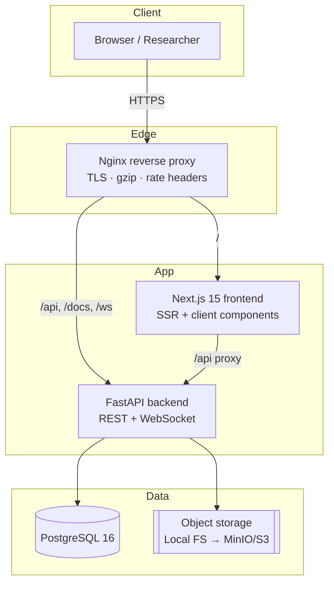
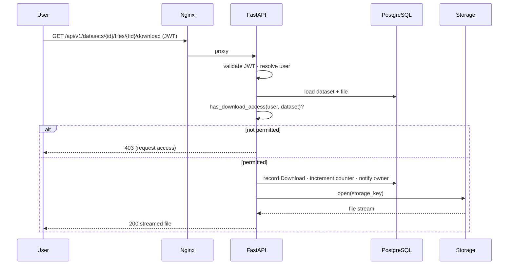

# Architecture

TAIRI DataHub follows a clean, layered architecture with a clear separation between
the frontend, the backend API, business services, the data layer and storage.

## System overview



## Backend layers

```
app/
├── api/v1/endpoints   →  HTTP layer (routing, request/response, auth guards)
├── schemas            →  Pydantic contracts (validation & serialization)
├── services           →  business logic (datasets, storage, email, notifications, citations)
├── models             →  SQLAlchemy ORM (persistence)
└── core               →  cross-cutting (config, security, db, deps, middleware)
```

Each layer depends only on the layer beneath it. Endpoints never touch storage
drivers directly — they go through `services`, which depend on the abstract
`StorageBackend` interface. This is what makes swapping local disk for S3 a pure
configuration change.

## Request flow (dataset download)



## Security architecture

| Concern | Mechanism |
|---------|-----------|
| Authentication | JWT access (short-lived) + refresh tokens, typed claims |
| Passwords | bcrypt via passlib |
| Authorization | Role-based dependencies (`require_roles`, `require_super_admin`, `require_uploader`) |
| Transport | TLS at Nginx |
| Rate limiting | Per-IP fixed-window middleware (stricter on auth routes) |
| Injection | SQLAlchemy parameterized queries; Pydantic input validation |
| XSS / clickjacking | Security headers middleware + Nginx headers |
| File safety | Path-traversal-safe local storage keys; SHA-256 checksums; AV scan hook |
| Auditing | `audit_logs` table records privileged actions with actor + IP |

## Scalability notes

- Denormalized counters (`download_count`, `view_count`, `total_size_bytes`) keep
  listing queries fast at scale.
- The WebSocket manager is in-process; for multi-instance deployments, back it with
  Redis pub/sub (interface is isolated in `services/notifications.py`).
- The rate limiter uses an in-memory store; swap for Redis behind a load balancer.
- Object storage offloads large files away from the database and app servers.
