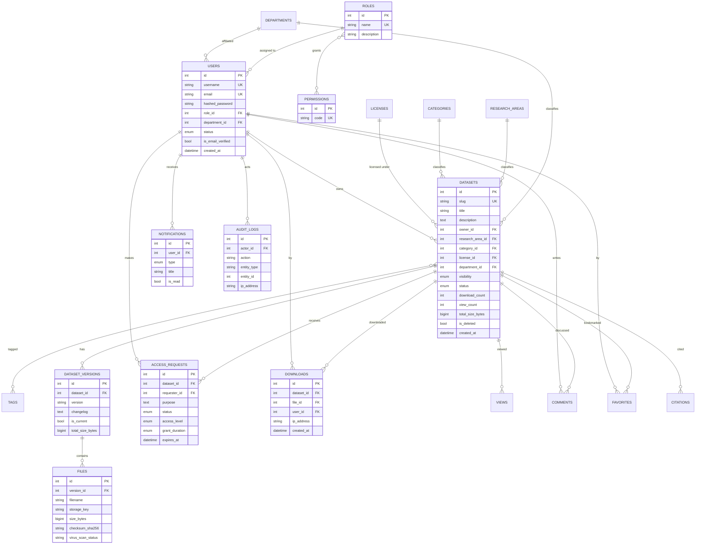

# Entity–Relationship Diagram

The normalized PostgreSQL schema. The full DDL is generated to
[`database/schema.sql`](../database/schema.sql).

## Key design decisions

- **Soft deletes** — datasets carry `is_deleted` + a `deleted` status so super admins
  can restore them; nothing is destroyed on user delete.
- **Versioning** — every dataset has one or more `dataset_versions`; files belong to a
  version, so historical versions remain fully accessible.
- **RBAC** — `roles ↔ permissions` is many-to-many, allowing capabilities to be tuned
  without code changes.
- **Denormalized counters** on `datasets` avoid expensive aggregate queries on listings.
- **Audit trail** — every privileged action is written to `audit_logs` with actor and IP.
